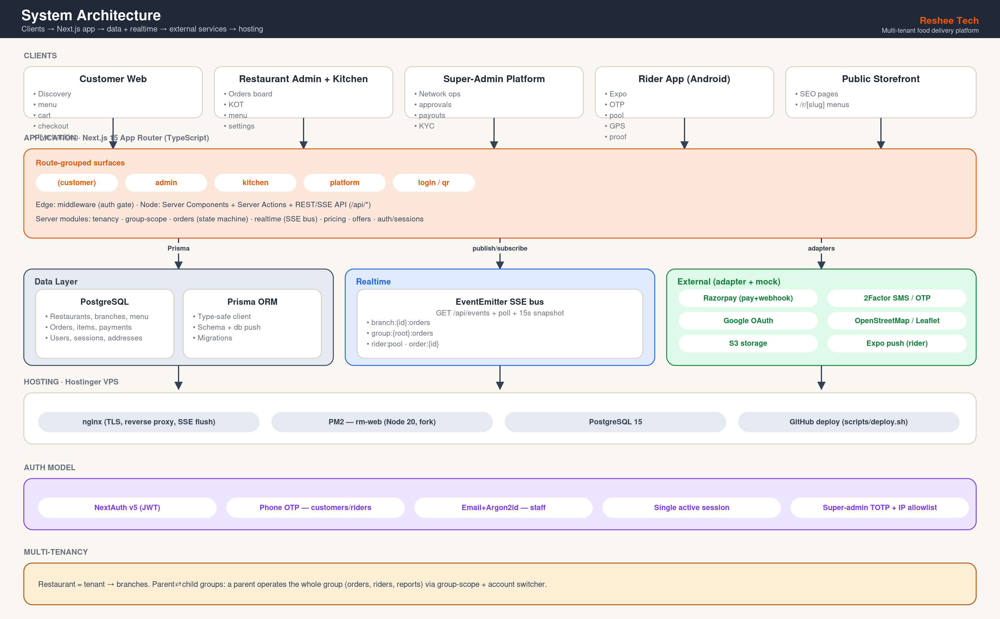
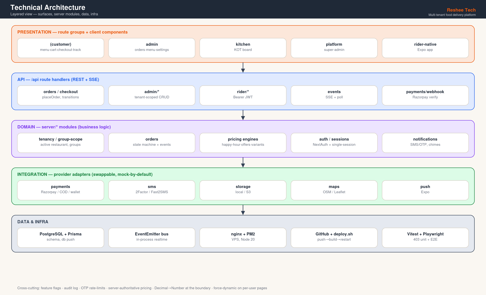
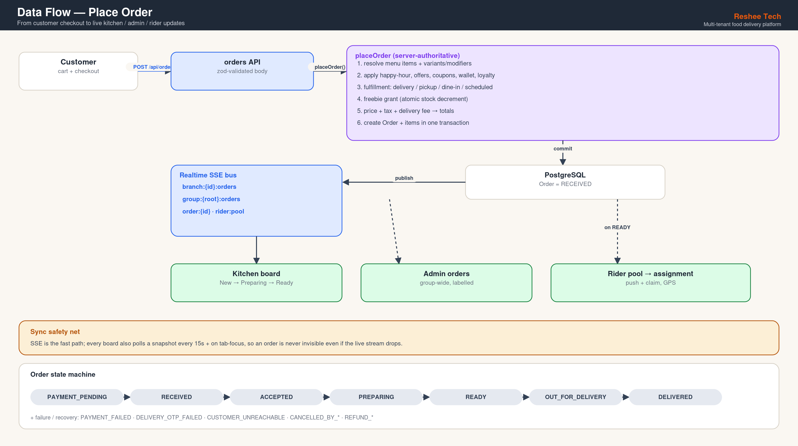
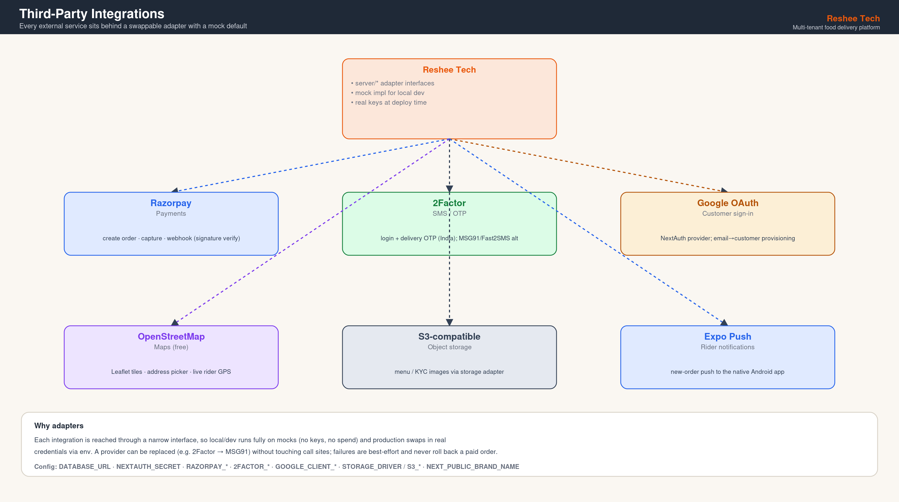
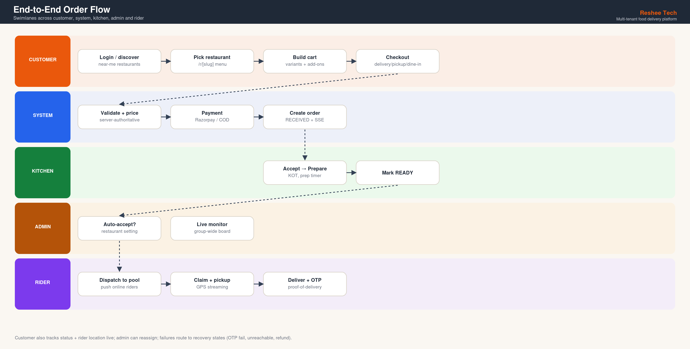

# Reshee Tech — Multi-Tenant Food Delivery Platform

A production-grade, multi-restaurant food ordering & delivery ecosystem — a self-hostable alternative to Swiggy/Zomato-style platforms, built for the Indian market. One deployable web app serves five surfaces (customer, restaurant admin, kitchen, super-admin platform, plus a public storefront), backed by a native Android rider app.

> **White-label:** the brand name is configurable via `NEXT_PUBLIC_BRAND_NAME` (code default `Reshee Tech`; the reference deployment ships as `Maverick's Food Hub`).

---

## Table of contents

- [Overview](#overview)
- [Surfaces](#surfaces)
- [Feature highlights](#feature-highlights)
- [Architecture](#architecture)
- [Tech stack](#tech-stack)
- [Repository layout](#repository-layout)
- [Local development](#local-development)
- [Testing](#testing)
- [Deployment](#deployment)
- [Environment variables](#environment-variables)
- [Further docs](#further-docs)

---

## Overview

Reshee Tech runs many independent restaurants on one platform. Each restaurant has its own menu, branches, staff, riders, offers and settings; a platform super-admin oversees the whole network. Restaurants can also be organized into **parent → child groups**, where a parent operates the entire group (orders, riders, reports) from one dashboard.

Customers discover nearby restaurants, order for **delivery, self-pickup, or dine-in**, pay online (Razorpay) or cash-on-delivery, and track their order live. Restaurant staff manage orders on a kitchen board and an admin dashboard; delivery riders work from a dedicated native Android app.

---

## Surfaces

| Surface | Path / App | Auth |
|---|---|---|
| **Public storefront / discovery** | `/`, `/restaurants`, `/r/[slug]` | none (browse) |
| **Customer** | `/r/[slug]`, `/cart`, `/checkout`, `/orders`, `/profile` | Phone OTP / Google |
| **Restaurant Admin** | `/admin` | Email + password (role `ADMIN`) |
| **Kitchen** | `/kitchen` | Email + password (role `KITCHEN`) |
| **Super-Admin Platform** | `/platform` | Email + password + TOTP + IP allowlist (`SUPER_ADMIN`) |
| **Rider** | `apps/rider-native` (Android app) | Phone OTP → Bearer JWT |

A single `/login` page role-routes users to the correct surface after sign-in (customers land on the restaurant picker, staff on `/admin`, etc.).

---

## Feature highlights

### Customer
- Location-first restaurant discovery ("restaurants near you" with delivery-radius filtering, cuisine chips, sort)
- Menu with **variants/sizes** + **modifier groups/add-ons**, happy-hour pricing, scheduled-category availability
- Cart, **delivery / self-pickup / dine-in** fulfillment, scheduled ("order for later") ordering
- Razorpay + COD + wallet + loyalty points + signup bonus; auto-applied offers, coupons & coupon campaigns
- Live order tracking (status timeline, rider GPS on map, delivery OTP), reorder, favorites, ratings & feedback
- Saved addresses with map picker, single source of truth across devices
- Reservations (book a table) for dine-in restaurants; freebie/gift threshold rewards

### Restaurant Admin (`/admin`)
- Live orders board + dedicated **kitchen panel** (New → Accepted → Preparing → Ready), KOT & invoice
- Menu management: categories, items, **bulk CSV/Excel import-export**, variants & modifiers, images, scheduling
- Combos, offers, coupons, coupon campaigns, happy hours, challenges, cross-sell, freebies
- Dine-in: table inventory + reservations board; order-flow toggles (auto-accept, scheduled, self-pickup, dine-in)
- Dedicated riders, rider safety, in-app messaging, branch pause, reports/analytics, audit/activity log
- **Restaurant groups:** parent owner gets one unified dashboard spanning all child restaurants (orders labelled by restaurant, shared riders, rolled-up reports), with an account-switcher

### Super-Admin Platform (`/platform`)
- Network-wide dashboard, restaurants, orders, riders, users, live tracking
- Restaurant approval, commission, brands, parent/child group assignment
- COD reconciliation, payouts & rider pay engine, KYC verification, surge zones, escalations
- Rider incentives, tiers, referrals, shifts, SOS, support, training modules
- Signup-bonus configuration, security (TOTP, IP allowlist)

### Rider (native Android app — `apps/rider-native`)
- Phone-OTP login, online/offline toggle + heartbeat, order pool with self-claim
- Active delivery flow (accept → reach restaurant → pickup → reach customer → deliver), delivery-OTP verification
- Native maps + foreground GPS streaming, camera proof-of-delivery, push notifications, batch dispatch
- Earnings, payouts, KYC/profile, in-app messaging; group-shared riders see each order's source restaurant

### Cross-cutting / operations
- **Real-time everywhere** via Server-Sent Events with a snapshot-poll safety net
- Order state machine with failure/recovery states, stuck-order escalation, payment-webhook hardening
- Notifications: SMS/OTP via 2Factor (India), pluggable adapters; order chimes for kitchen/admin
- Feature flags, OTP abuse protection + rate limits, admin audit log

---

## Architecture

A single **Next.js 15 App Router** application, route-grouped by surface (`(customer)`, `admin`, `kitchen`, `platform`), sharing one **PostgreSQL** database through **Prisma**. Server Components + Server Actions + a thin REST/SSE API under `/api`.

- **Multi-tenancy** — every restaurant is a tenant with branches; staff are scoped via `RestaurantUser` memberships, resolved by `server/tenancy.ts`. An active-restaurant cookie + account switcher lets an operator move between the restaurants they manage.
- **Restaurant hierarchy** — `Restaurant.parentId` self-relation forms parent → child groups; `server/group-scope.ts` resolves the set of restaurants/branches a parent operates, and order monitoring spans every restaurant an account manages.
- **Realtime** — an in-process EventEmitter bus (`server/realtime.ts`) fans out order/status/location events over SSE (`/api/events`); clients fall back to polling (`/api/events/poll`) and a periodic snapshot so no order is ever invisible for more than ~15s.
- **Auth** — NextAuth v5. Customers/riders use phone OTP; staff & super-admins use email + Argon2id passwords; customers may also use Google OAuth. **Single active session** per user (a new login signs out other devices), login history, and super-admin TOTP + IP allowlist.
- **Payments** — Razorpay (with webhook verification) + COD reconciliation + wallet/loyalty, behind provider adapters with mock implementations for local dev.
- **Pricing authority** — happy-hour, variant/modifier, offer, coupon and freebie logic are resolved **server-side** at order time, so the cart can never dictate price.

See [`docs/ARCHITECTURE.md`](docs/ARCHITECTURE.md) and [`docs/ARCHITECTURE-V2.md`](docs/ARCHITECTURE-V2.md) for the deep dive.

---

## Diagrams

Generated by [`docs/gen-diagrams.py`](docs/gen-diagrams.py) (`python3 docs/gen-diagrams.py`) — edit the script and re-run to keep them in sync.

### System architecture


### Technical architecture (layers)


### Data flow — place order


### Third-party integrations


### End-to-end order flow


---

## Tech stack

| Layer | Technology |
|---|---|
| Web framework | Next.js 15 (App Router), React, TypeScript |
| Styling / UI | Tailwind CSS, shadcn-style components, lucide-react |
| Database / ORM | PostgreSQL + Prisma 5 |
| Auth | NextAuth v5 (credentials + Google OAuth), Argon2id |
| Realtime | Server-Sent Events (in-process EventEmitter bus) |
| Payments | Razorpay, COD, wallet/loyalty |
| Notifications / SMS | 2Factor (India OTP), pluggable adapters |
| Maps | Leaflet + OpenStreetMap (free) |
| Storage | Local / S3-compatible adapter |
| Rider app | React Native + Expo (SDK 54), EAS Build (Android APK) |
| Testing | Vitest (unit), Playwright (E2E) |
| Hosting | Hostinger VPS · nginx · PM2 · Node 20 |

---

## Repository layout

```
.
├── apps/
│   ├── web/                     Next.js 15 app — all web surfaces + API
│   │   ├── src/app/
│   │   │   ├── (customer)/      Storefront, discovery, cart, checkout, profile
│   │   │   ├── admin/           Restaurant admin dashboard
│   │   │   ├── kitchen/         Kitchen order board
│   │   │   ├── platform/        Super-admin platform
│   │   │   ├── login/           Unified role-aware sign-in
│   │   │   └── api/             REST + SSE endpoints
│   │   ├── src/server/          Server-only: db, auth, tenancy, group-scope,
│   │   │                        orders, realtime, payments, notifications, …
│   │   ├── src/components/      UI components
│   │   ├── src/lib/             Pure utilities
│   │   ├── prisma/              schema.prisma, seeds, ops scripts
│   │   └── __tests__/, tests/   Vitest + Playwright
│   ├── rider-native/            React Native (Expo) rider Android app
│   └── android-rider/           Legacy Capacitor shell (superseded by rider-native)
├── deploy/                      nginx.conf, PM2 ecosystem, build-apk, backup
├── docs/                        Architecture, deploy, API, roadmap, diagrams
├── scripts/                     deploy.sh / deploy-remote.sh (one-command deploy)
├── docker-compose.yml           Postgres + app (local/any-host)
└── Dockerfile
```

---

## Local development

Requires **Node 20+** and **PostgreSQL 15+** (or use Docker).

```bash
# Option A — Docker (Postgres + app)
docker compose up --build

# Option B — local
cd apps/web
cp .env.example .env          # set DATABASE_URL, secrets, etc.
npm install
npm run db:push               # apply Prisma schema
npm run db:seed               # sample restaurants, menu, users
npm run dev                   # http://localhost:3000
```

Useful scripts (`apps/web`): `npm run db:seed:cuisines`, `npm run db:enable-order-flow` (turn on self-pickup + scheduled for active restaurants), `npm run db:studio`, `npm run typecheck`, `npm test`.

**Demo credentials** (change in production — see [`docs/DEMO-ACCOUNTS.md`](docs/DEMO-ACCOUNTS.md)):
- Admin: `admin@restaurant.local` / `Admin@12345`
- Kitchen: `kitchen@restaurant.local` / `Kitchen@12345`
- Customer / Rider: phone OTP — in dev the code is printed to the server console.

---

## Testing

```bash
cd apps/web
npm test            # Vitest unit suite (server logic, pricing, resolvers — 400+ tests)
npm run test:e2e    # Playwright end-to-end flows
npm run typecheck   # tsc --noEmit (web)
```

The rider app is type-checked separately: `cd apps/rider-native && npx tsc --noEmit`.

---

## Deployment

Reference target: a single **Hostinger VPS** running **PostgreSQL + nginx + PM2** (process `rm-web`), with the repo at `/opt/restaurant-manager` and Node managed by nvm.

One-command deploy from your workstation:

```bash
bash scripts/deploy.sh            # push → SSH → pull → install → build → pm2 restart
bash scripts/deploy.sh --migrate  # also apply a Prisma schema change (prisma db push)
```

- `scripts/deploy.sh` runs on your machine: pushes to GitHub, then runs the remote deploy over SSH.
- `scripts/deploy-remote.sh` runs on the VPS: resolves the nvm-managed Node, pulls, `npm install`, optional `prisma db push`, `npm run build` (from `apps/web`), and `pm2 restart`.
- Override host/paths via env vars: `REMOTE_HOST`, `APP_DIR`, `BRANCH`, `PM2_APP`.

The Android rider APK is built with EAS — see [`apps/rider-native/BUILD.md`](apps/rider-native/BUILD.md) and `deploy/build-apk.sh`. Hosting guidance: [`docs/PRODUCTION-DEPLOY.md`](docs/PRODUCTION-DEPLOY.md), [`docs/DEPLOY-INDIA.md`](docs/DEPLOY-INDIA.md).

---

## Environment variables

Key variables (full list in `apps/web/.env.example` and `deploy/.env.production.example`):

| Variable | Purpose |
|---|---|
| `DATABASE_URL` | PostgreSQL connection string |
| `NEXTAUTH_URL`, `NEXTAUTH_SECRET` | Auth base URL + signing secret |
| `NEXT_PUBLIC_BRAND_NAME` | White-label platform name |
| `GOOGLE_CLIENT_ID` / `GOOGLE_CLIENT_SECRET` | Customer Google sign-in (optional) |
| `ALLOW_CUSTOMER_SELF_SIGNUP` | `false` locks login to pre-registered accounts (default on) |
| `NOTIFIER_SMS`, 2Factor keys | SMS/OTP delivery (India) |
| Razorpay keys | Online payments |
| `STORAGE_DRIVER`, S3 keys | Image/file storage |

---

## Further docs

- [`docs/ARCHITECTURE.md`](docs/ARCHITECTURE.md) / [`docs/ARCHITECTURE-V2.md`](docs/ARCHITECTURE-V2.md) — system design + diagrams
- [`docs/API.md`](docs/API.md) — endpoint reference
- [`docs/ROADMAP.md`](docs/ROADMAP.md) — feature status & roadmap
- [`docs/PRODUCTION-DEPLOY.md`](docs/PRODUCTION-DEPLOY.md), [`docs/DEPLOY-INDIA.md`](docs/DEPLOY-INDIA.md), [`docs/GIT-BACKUP.md`](docs/GIT-BACKUP.md) — operations
- [`docs/KYC-VERIFICATION.md`](docs/KYC-VERIFICATION.md), [`docs/SUBDOMAIN-TENANCY.md`](docs/SUBDOMAIN-TENANCY.md) — feature deep dives

---

## License

MIT.
