# Maverick's Food Hub — Architecture Documentation v2

**Version:** 2.0 · **Status:** Phase 1 production, Phase 2 roadmap approved
**Audience:** Engineering, leadership, investor demos, onboarding, operations planning
**Stack:** Next.js 15 modular monolith · React 19 · TypeScript · Prisma · PostgreSQL · SSE · Cloudflare/nginx/PM2 on VPS

> This is the comprehensive enterprise-grade documentation package — ten diagrams, narrative captions, design rationale, and a scaling roadmap. The original Phase-1 overview at `ARCHITECTURE.md` is preserved as a historical reference. Standalone `.mmd` files for every diagram live in `docs/diagrams/` for paste-in to Excalidraw, draw.io, or [mermaid.live](https://mermaid.live).

---

## Quick Context

Maverick's Food Hub is an **India-first, low-cost, multi-tenant food ordering and delivery platform** designed to run profitably on a single VPS in Phase 1 and scale horizontally only when revenue demands it. Customers order through a **QR-driven mobile PWA** (no native customer app). Only **riders ship with an Android app** (Capacitor wrapper around the same PWA codebase). Realtime is built on **Server-Sent Events** plumbed through an in-process EventEmitter — no Redis, no message broker, no Kubernetes.

The deliberate constraint set: ship a complete two-sided marketplace experience supporting umbrella brands with multiple cuisines, deep operational tooling, and rich growth surfaces (offers, happy hours, challenges, cross-channel coupons, signup bonuses, post-delivery feedback) without leaving the modular-monolith comfort zone until traffic justifies the move.

## Reading guide

Each section: **diagram → component table → design rationale**.

1. [Technical Architecture](#1-technical-architecture)
2. [Business Architecture](#2-business-architecture)
3. [Data Flow Diagram](#3-data-flow-diagram)
4. [System Infrastructure & Scaling Roadmap](#4-system-infrastructure--scaling-roadmap)
5. [Realtime Communication](#5-realtime-communication)
6. [Order State Machine](#6-order-state-machine)
7. [Ecosystem Infographic](#7-ecosystem-infographic)
8. [Live Operations Dashboard](#8-live-operations-dashboard)
9. [Multi-tenant Architecture](#9-multi-tenant-architecture)
10. [Mobile + Web Experience Journey Map](#10-mobile--web-experience-journey-map)
11. [Appendix: Scaling Roadmap, Design Principles](#11-appendix)

## Glossary

| Term | Meaning |
|---|---|
| **Umbrella brand** | A `Brand` row that owns multiple `Restaurant` rows ("cuisine concepts") — e.g. Maverick Hospitality houses Italia Pizza, Biryani Zone, Wok and Sizzler, etc. |
| **Cuisine concept** | A `Restaurant` row under a Brand. Has its own menu, branches, offers, KYC riders. |
| **Branch** | A physical kitchen + service area. Multiple Branches per Restaurant. |
| **Pool** | Platform-wide queue of READY orders. Any approved rider can claim. |
| **SSE channel** | A named EventEmitter topic; clients subscribe via `/api/events?channel=…`. |
| **PWA** | Progressive Web App — the customer ordering site, also wrapped as a rider Android shell via Capacitor. |

---

## 1. Technical Architecture

> **The whole platform on one page.** Layered modular-monolith with a thin client tier (PWA + Capacitor rider shell + admin React surfaces), a unified Next.js app server that exposes API routes + server-rendered pages, a Prisma data tier on PostgreSQL, an in-process realtime fan-out, and a small ring of external providers for SMS / email / payments.

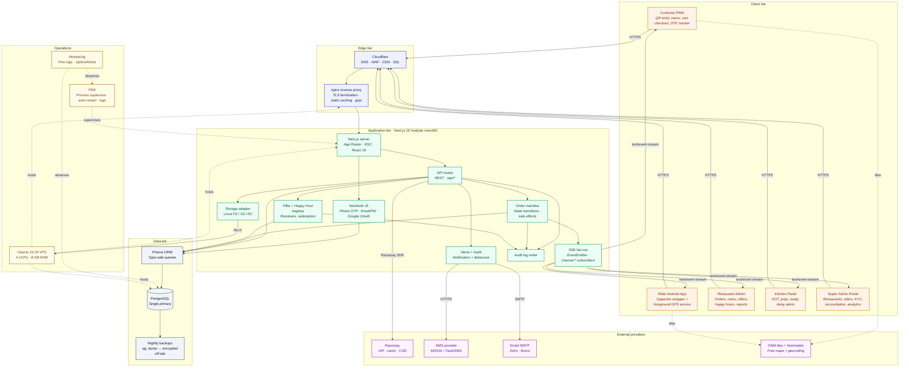

### Component breakdown

| Layer | Component | Responsibility |
|---|---|---|
| Client | Customer PWA | Mobile-first ordering surface entered via QR. Single Next.js codebase, served as a PWA. |
| Client | Rider Android | Capacitor wrapper around the rider PWA path. Adds foreground GPS service, push permission, install-as-app shell. |
| Client | Admin / Kitchen / Super Admin | Same Next.js app, role-gated routes (`/admin`, `/kitchen`, `/platform`). React Server Components for read-heavy pages. |
| Edge | Cloudflare | Free-tier DNS + WAF + asset cache + universal SSL. |
| Edge | nginx | TLS termination, static asset caching, gzip, upstream to Next.js on `127.0.0.1:3000`. |
| App | Next.js server | Single Node.js process. App Router pages + API routes share one bundle. |
| App | Order machine | `src/server/orders.ts` is the only place that mutates `Order.status`. Validates transitions, fires side effects (loyalty, signup bonus, challenge progress, audit, SSE publish). |
| App | Offer + Happy Hour engines | Pure resolvers (`offers.ts`, `happy-hours.ts`) called from `pricing.ts` and `placeOrder`. Tested without a DB. |
| App | SSE fan-out | `src/server/realtime.ts` — Node `EventEmitter` with named channels. HTTP route streams `text/event-stream`. |
| App | Alerts | `src/server/alerts.ts` — debounce-aware menu/integration alert dispatcher. Writes `NotificationLog` + `AuditLog`. |
| App | Storage adapter | Pluggable interface; Phase 1 writes to local FS, Phase 2 swaps to S3/R2 with zero call-site changes. |
| Data | Prisma | Generates type-safe queries from `prisma/schema.prisma`. |
| Data | PostgreSQL | Single primary on the same VPS. Phase 1: WAL archiving + nightly `pg_dump` to encrypted off-site bucket. |
| External | Razorpay | UPI / card / netbanking. COD handled internally. |
| External | SMS + Email | Pluggable through `IntegrationCredential` rows (encrypted at rest via AES-256-GCM). |
| External | OSM | Free tile server + Nominatim geocoding for address autocomplete. |
| Ops | PM2 | Single-instance process supervisor with log rotation and crash restart. |
| Ops | Monitoring | Pino structured logs + UptimeRobot external health checks. |

### Design rationale

- **Modular monolith over microservices.** The whole product fits in one Node.js process. Each domain (orders, offers, happy hours, challenges, feedback, alerts) is a separate `src/server/*.ts` module with its own pure resolver + DB-aware boundary. Modules talk through function calls and the in-process `EventEmitter` — no network hops, no service mesh, no service discovery. When a module's load justifies extraction (Phase 4), the resolver lifts out cleanly.
- **SSE over WebSockets.** SSE rides on plain HTTP/2, traverses nginx + Cloudflare without sticky-session tricks, auto-reconnects in every modern browser, and survives the long mobile-network coffee breaks our riders take. WebSocket benefits (bidirectional, binary frames) aren't worth the operational overhead at this stage.
- **VPS over Kubernetes.** A single 8 GB VPS comfortably runs the app server, Postgres, nginx, PM2, and backup cron jobs for the first ~20 restaurants × 500 daily orders each. Phase 3 splits the DB onto its own box; Phase 4 fronts multiple app servers with a load balancer.
- **Pluggable externals.** Payments, SMS, email, storage, maps each go through an `IntegrationCredential`-driven adapter. Provider swaps are a config change, not a code change. AES-256-GCM keeps credentials encrypted at rest.

---

## 2. Business Architecture

> **Who does what.** Six business actors, ten business capabilities, and the relationships that turn a single delivered order into revenue, loyalty, and operational data.

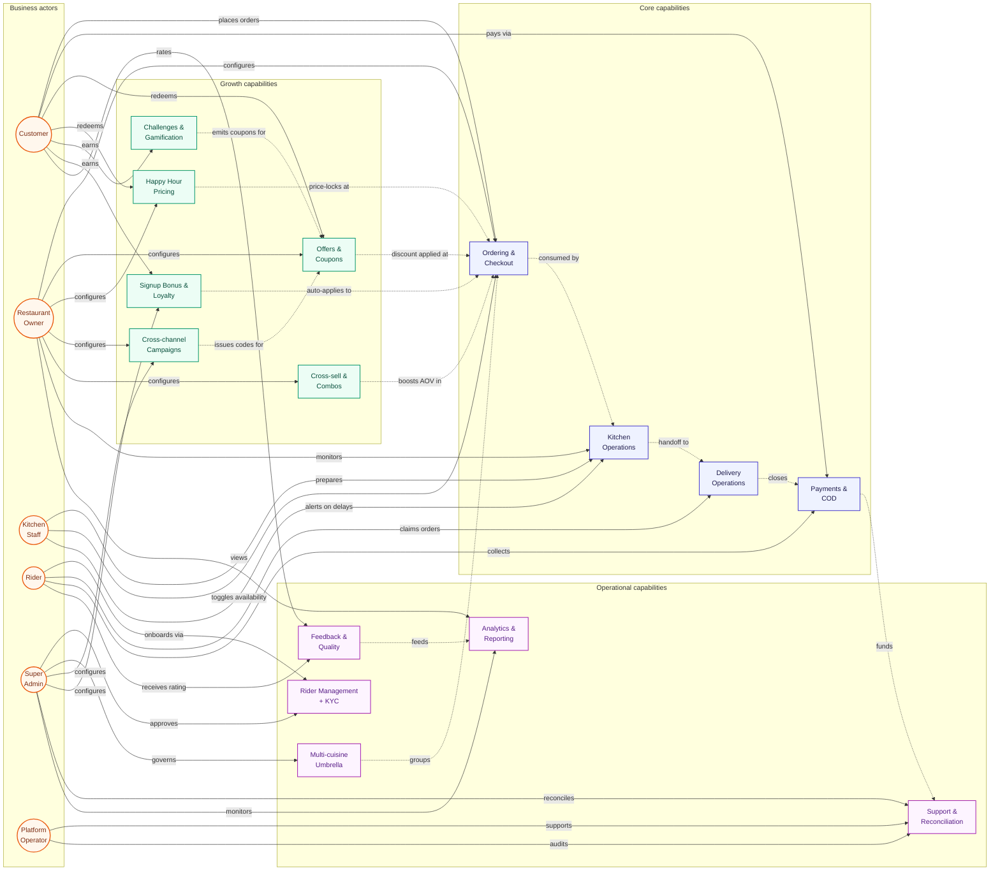

### Capability responsibilities

| Capability | Owner | Surface | Inputs | Outputs |
|---|---|---|---|---|
| Ordering & Checkout | Customer + Restaurant Owner | Customer PWA, Admin orders board | Cart, address, payment method | `Order` row, `OrderItem` rows, SSE event |
| Kitchen Operations | Kitchen Staff | Kitchen Panel | Order state, item availability | KOT, status transitions |
| Delivery Operations | Rider + Restaurant | Rider Android app, Admin live tracking | READY orders, rider GPS | `RiderAssignment`, `DeliveryLocationPing` |
| Payments & COD | Customer + Razorpay | Checkout, COD reconciliation | Order total, payment method | `Payment`, `CodCollection` |
| Offers & Coupons | Restaurant Owner | Admin → Offers | Discount config | `Offer`, `OfferRedemption` |
| Happy Hour | Restaurant Owner | Admin → Happy Hours | Time-of-day rules | Item price overrides at checkout |
| Cross-channel Campaigns | Restaurant Owner | Admin → Coupon Campaigns | Code prefix, channel direction | `CouponCampaign` → `Offer` |
| Challenges | Super Admin | `/admin/challenges` | Target, window, reward config | `Challenge`, `ChallengeProgress`, `ChallengeReward` |
| Signup Bonus & Loyalty | Super Admin | `/platform/signup-bonus` | Bonus amount, split count | `SignupBonusGrant`, ledger entries |
| Cross-sell & Combos | Restaurant Owner | Admin → Cross-sell + Combos | Parent item, suggested items | `CrossSell`, `Combo` rows |
| Rider Management + KYC | Super Admin | `/platform/kyc` | Aadhaar, license, insurance docs | `RiderKycDocument` (APPROVED) |
| Multi-cuisine Umbrella | Super Admin | `/platform/brands` | Cuisine assignments | `Brand` rollups |
| Feedback & Quality | Customer + all roles | `/profile/orders`, `/admin/feedback` | Ratings + tags + image | `OrderFeedback`, role-redacted views |
| Analytics & Reporting | Restaurant Owner + Super Admin | `/admin/reports`, `/platform/analytics` | All order + offer + feedback data | Trend lines, leaderboards |
| Support & Reconciliation | Platform Operator | `/platform/support`, COD screen | Tickets, COD bags | Resolved tickets, settled COD |

### Design rationale

The core flow (order → kitchen → delivery → payment) stays untouched by the growth layer — every promotional capability is a **modifier** that decorates the price or unlocks an entitlement, never a special-case branch in the order machine. That isolation is what lets us add nine offer types, happy-hour pricing, signup bonuses, and gamification without making `placeOrder` a 2000-line mess.

---

## 3. Data Flow Diagram

> **What happens between QR scan and a positive feedback row.** Every API call, every DB read/write, every realtime push.

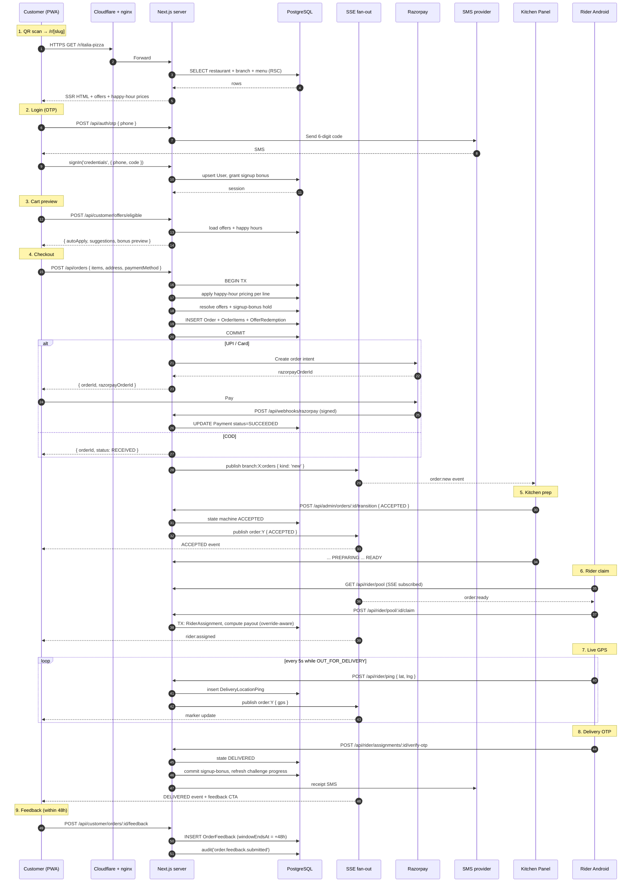

### Design rationale

- **Idempotency is non-negotiable.** Payment webhooks, rider OTP verification, and bonus commits all check for prior side effects before re-applying. Razorpay's webhook is HMAC-verified and idempotency-keyed by `razorpayPaymentId`.
- **Transactions wrap the critical writes.** Order creation includes offer redemptions, signup-bonus pending hold, and `OrderItem` snapshots in a single `prisma.$transaction` — partial failure rolls everything back.
- **SSE is fire-and-forget downstream of DB writes.** A failed publish never rolls back a committed order. The customer reconnect logic re-syncs on the next render.

---

## 4. System Infrastructure & Scaling Roadmap

> **Where bits live today and how we scale when we need to.** Single-VPS Phase 1 with a clear, cost-justified path through three growth phases.

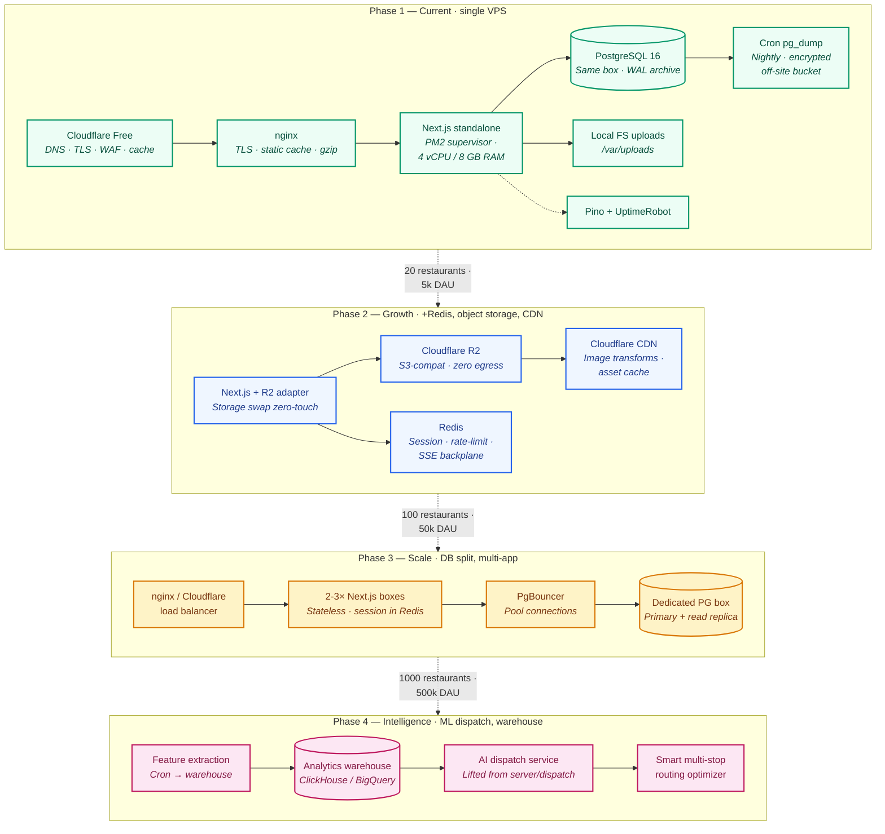

### Cost snapshot per phase

| Phase | Monthly target cost | Triggers entry |
|---|---|---|
| Phase 1 | ~₹4 000 (₹3 500 VPS + ₹500 Cloudflare-ish) | Day 1 |
| Phase 2 | ~₹12 000 | App memory > 70% sustained, image bandwidth > 50 GB/mo |
| Phase 3 | ~₹35 000 | DB CPU > 60% sustained, concurrent SSE > 5 000 |
| Phase 4 | ~₹85 000 | Dispatch SLA misses, > 50k orders/day |

### Design rationale

We refuse to pay for what we don't yet need. A 4 vCPU / 8 GB VPS handles the first 20 restaurants comfortably. Redis enters only when we need a multi-process SSE backplane (after we split app servers). The warehouse comes online only when feature extraction outgrows ad-hoc Postgres aggregations. Every transition is reversible: nothing in Phase 1 architecturally precludes any of the later phases.

---

## 5. Realtime Communication

> **How a kitchen panel knows a new order arrived 250 ms after the customer tapped Pay.** SSE channels, the EventEmitter backbone, and the polling fallback for clients in tunnel-mode networks.

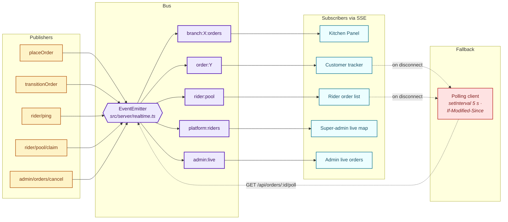

### Channel catalogue

| Channel | Publisher | Subscribers | Payloads |
|---|---|---|---|
| `branch:<branchId>:orders` | placeOrder, transitionOrder | Kitchen Panel, Admin orders | `order:new`, `order:status` |
| `order:<orderId>` | transitionOrder, rider/ping | Customer tracker, Admin drawer | status, ETA, GPS |
| `rider:pool` | transitionOrder (READY), claim | Rider order list | `order:new`, `order:claimed` |
| `platform:riders` | rider/ping | Super-admin live map | All rider GPS pings |
| `admin:live` | transitionOrder, escalation engine | Super-admin live ops | Alerts, delays |

### Why SSE not WebSockets?

| Concern | SSE | WebSockets |
|---|---|---|
| Direction | Server → Client | Bidirectional |
| Transport | HTTP/1.1 + HTTP/2 | Custom over TCP after upgrade |
| Reconnect | Automatic in every browser | Manual library logic |
| Proxy / CDN compatibility | Trivial — it's just HTTP | Sticky sessions, header forwarding |
| Cloudflare free tier | Works out of the box | Needs paid plans for sticky |
| Mobile network friendliness | Resilient to network hops | Sensitive |
| Authentication | Cookie / Authorization header | Per-message JWT or upgrade-time |

Customer-side traffic is **overwhelmingly server-to-client** — order status updates, GPS pings, kitchen alerts, feedback prompts. The few client-to-server cases (place order, claim, transition) are perfectly modelled as plain HTTP POSTs. We get every benefit we'd hope for from WebSockets with none of the operational tax.

### Fallback polling

Some hotel Wi-Fi and corporate networks strip `Content-Type: text/event-stream`. When the EventSource fails to connect within 10 s, the client falls back to a 5-second `If-Modified-Since`-aware `GET /api/orders/:id/poll`. The polling endpoint returns the same shape as an SSE message so call sites need no special-casing.

---

## 6. Order State Machine

> **The single source of truth for status transitions.** Every transition is validated against this graph in `src/server/orders.ts`. Illegal transitions throw `OrderTransitionError`.

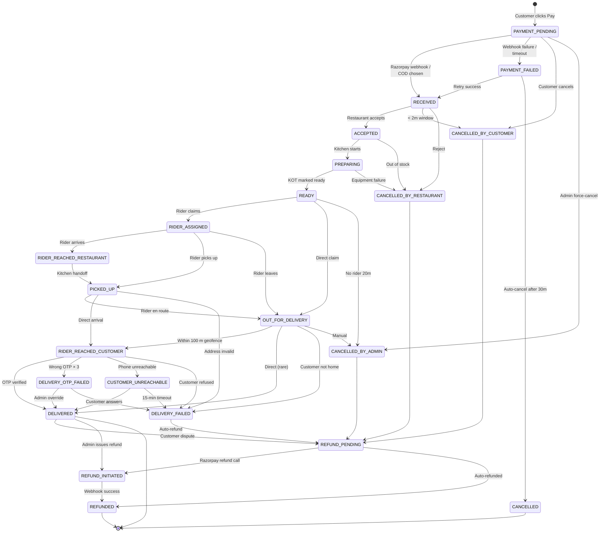

### Side effects per transition

| Transition | Side effects |
|---|---|
| → RECEIVED | Loyalty earn preview, SSE `branch:X:orders`, customer SMS |
| → ACCEPTED | KOT visible, ETA computed |
| → READY | Pool publish `rider:pool`, kitchen-ready SMS |
| → RIDER_ASSIGNED | Rider's payout snapshot, SSE `order:Y:assigned` |
| → DELIVERED | Loyalty credit, signup-bonus commit, challenge progress refresh, feedback CTA, customer SMS |
| → CANCELLED_* | Signup-bonus restore, offer redemption rollback, refund kick-off |
| → REFUNDED | Razorpay refund call, COD waiver if applicable, audit log |

### Design rationale

A single declarative `ALLOWED_NEXT: Record<OrderStatus, OrderStatus[]>` table at the top of `orders.ts` means every illegal transition fails at compile + runtime. Side effects are colocated with the transition (not scattered across callers) so adding a new effect — like the recent `commitSignupBonusForOrder` and `refreshChallengeProgressForOrder` on DELIVERED — is a one-line change.

---

## 7. Ecosystem Infographic

> **The whole platform as a hub-and-spoke ecosystem.** Each spoke is a self-contained capability that plugs into the central order engine.

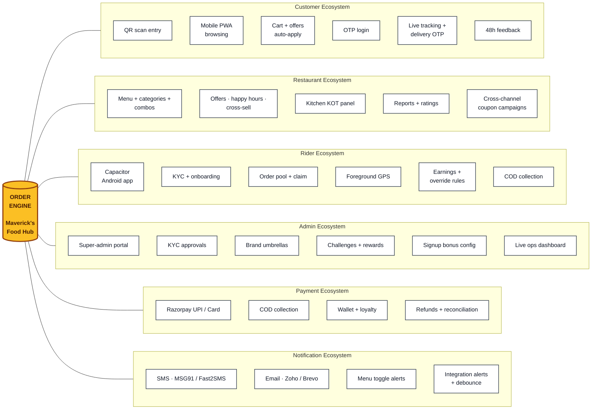

### Pitch deck soundbites

- **QR ordering.** No app install for customers. A QR sticker at the table or door is the entry surface.
- **Realtime everywhere.** SSE delivers status updates, GPS pings, and kitchen alerts in < 250 ms — without WebSocket complexity.
- **Multi-cuisine umbrellas.** One operator runs Italia Pizza, Biryani Zone, Wok and Sizzler under one brand with shared kitchens.
- **Low-cost architecture.** Phase 1 fits on a single ₹3 500/mo VPS with off-site backups and a Cloudflare CDN.
- **India-first.** UPI-native, COD-native, OSM tiles to avoid Google Maps spend, OTP-first login.
- **Mobile-first ordering.** Tailwind + the customer page hierarchy designed for 360–390 px viewports.
- **Rider Android app.** Capacitor wrapper around the rider PWA — one codebase, native shell where it matters (background GPS).

---

## 8. Live Operations Dashboard

> **The operational control center.** What super-admins see when they sign in to run a dinner rush.

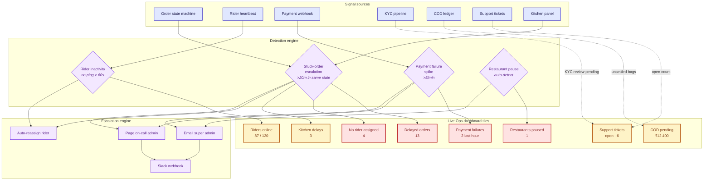

### Alert thresholds

| Signal | Yellow | Red | Action |
|---|---|---|---|
| Order stuck in PREPARING | > 15 m | > 25 m | Page kitchen lead; auto-suggest re-prep |
| Order in READY with no rider | > 5 m | > 12 m | Boost payout by ₹20; broadcast to all branches |
| Rider GPS silent | > 60 s | > 5 m | Mark "stale"; reassign if order in progress |
| Payment failure rate | > 2% | > 8% | Page on-call; switch Razorpay → fallback gateway |
| COD bag unsettled | > 24 h | > 48 h | Auto-deduct from rider next payout |

### Design rationale

The escalation engine is a single in-process scheduler with no external dependencies. Every signal source writes to the same `OrderEscalation` table, and a cron-style worker scans for breaches every 30 seconds. When an alert fires, it lands on the live ops dashboard via SSE before any external page goes out — operators see issues before their phones buzz.

---

## 9. Multi-tenant Architecture

> **One platform, many brands, many cuisines, many branches — with clean tenant boundaries everywhere it matters.**

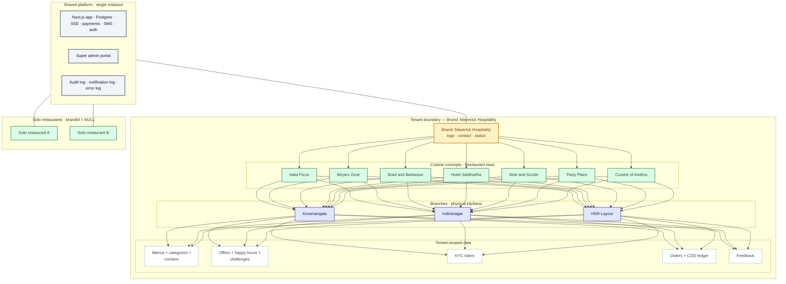

### Isolation by row, not by schema

Every domain table carries a tenant-discriminating FK chain — `OrderItem` → `Order` → `Branch` → `Restaurant` → `Brand` — and every server-side helper (`requireRestaurant`, `currentBrand`) seeds the query's `WHERE` clause from the session. Tenants share infrastructure but never see each other's rows. This row-level model is operationally cheap (no per-tenant migrations, no per-tenant deploys) and trivially supports the "umbrella brand owns N cuisines" case that schema-per-tenant designs make painful.

### Reports compose at any tier

The brand layer exposes four rollup levels through one DB-aware resolver (`getBrandSalesRollup`):

```
brand-wide → cuisine-level (per Restaurant)
            → branch-level (per Branch)
            → item-level (per OrderItem)
```

A single super-admin can drill from "Maverick Hospitality earned ₹4.2L this month" to "Italia Pizza · Koramangala branch · Margherita Pizza · 240 orders · ₹72k" in three clicks.

---

## 10. Mobile + Web Experience Journey Map

> **Four actors, four journeys, one shared platform. The UX rhythm each role lives in.**

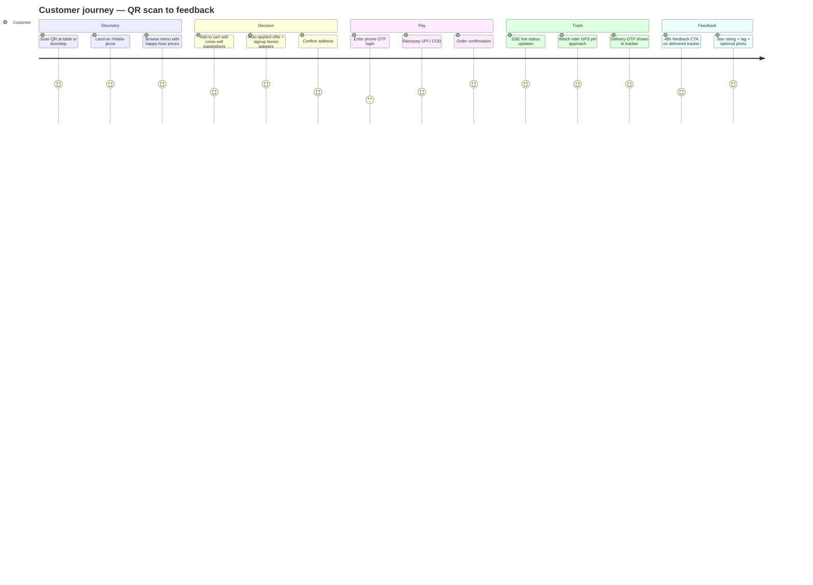

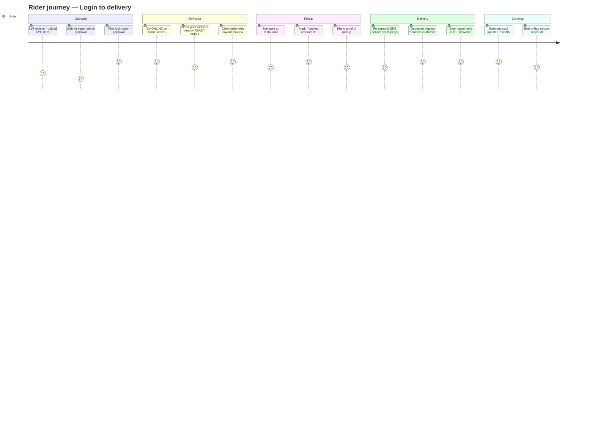

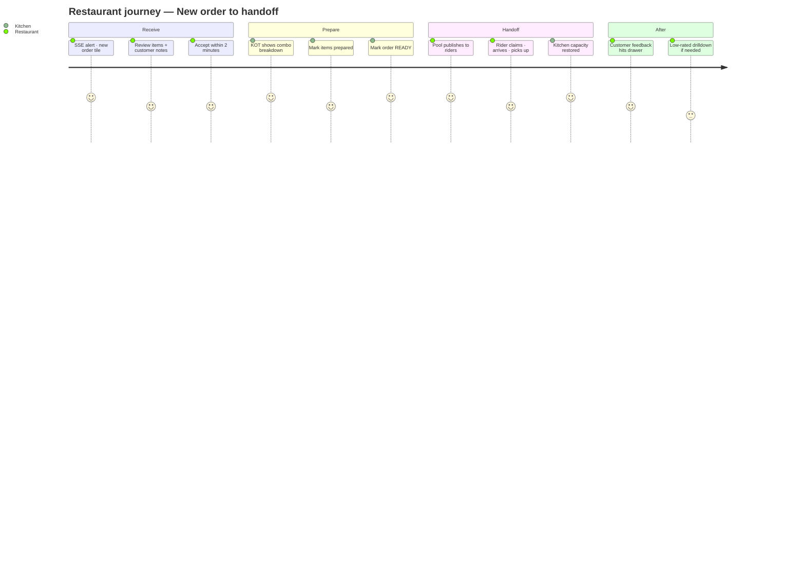

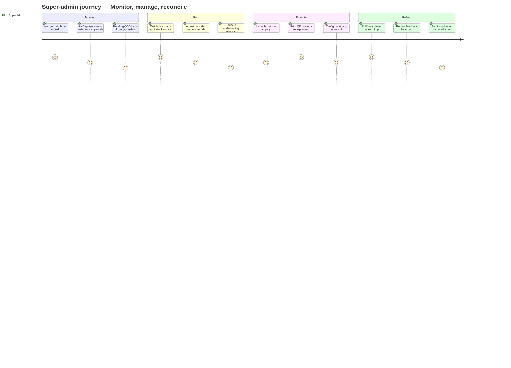

### Design rationale

Every journey shares the same realtime backbone — the customer's order tracker, the rider's delivery shift, the restaurant's kitchen panel, and the super-admin's live map are all subscribed to overlapping SSE channels around the same `Order` row. When status changes, the right people see it in the right surface within a couple hundred milliseconds, without any of them polling.

---

## 11. Appendix

### Scaling roadmap (visual)

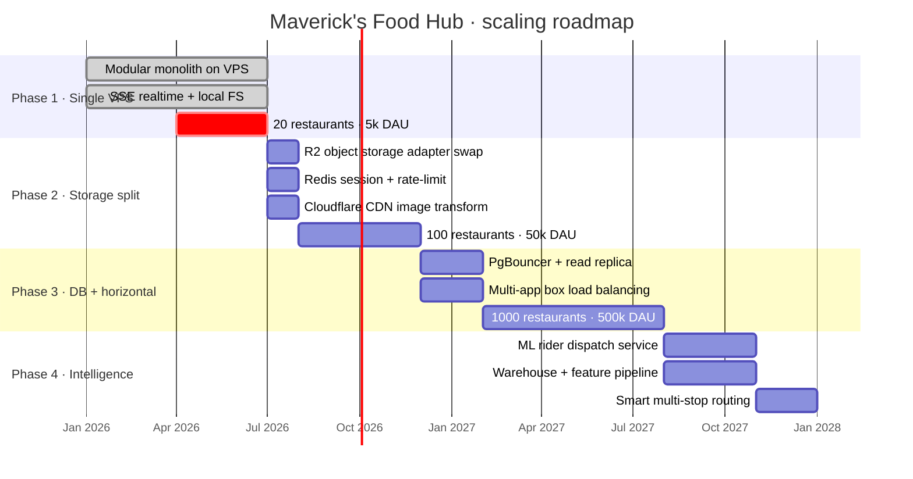

### Design principles (one-liners)

1. **Modular monolith first.** Domains are folders, not services.
2. **Pure resolvers, DB-aware boundaries.** Every domain has a tested pure core + a thin DB-aware wrapper.
3. **State machines, not status fields.** Order, KYC, feedback windows, signup-bonus lifecycle — all explicit graphs.
4. **Idempotency at every external surface.** Webhooks, OTP verification, bonus consumption.
5. **Audit everything, mask everything.** AuditLog row per mutation; secrets never leave the server in plaintext.
6. **Tenants are rows, not databases.** Brand → Restaurant → Branch is a tree of FKs.
7. **Configuration over code for promos.** Nine offer types, three happy-hour shapes, five challenge kinds — all data, no branches in the order machine.
8. **Pluggable externals.** SMS, email, payments, storage, maps — adapter per provider, swap via config.
9. **Real-time is fire-and-forget downstream of DB.** A failed SSE publish never rolls back a paid order.
10. **No premature cloud-native.** Redis enters in Phase 2. K8s never enters unless the math forces it.

### Reference files (for engineers reading this with the codebase open)

| Concern | File |
|---|---|
| Order state machine | `src/server/orders.ts` |
| Offer engine | `src/server/offers.ts` |
| Happy-hour resolver | `src/server/happy-hours.ts` |
| Challenge engine | `src/server/challenges.ts` |
| Signup-bonus engine | `src/server/signup-bonus.ts` |
| Brand rollups | `src/server/brands.ts` |
| Feedback resolver | `src/server/feedback.ts` |
| Alert dispatcher | `src/server/alerts.ts` |
| Category schedules | `src/server/category-availability.ts` |
| KYC validators | `src/server/kyc.ts` |
| Payout overrides | `src/server/payouts.ts` |
| Pricing | `src/server/pricing.ts` |
| Realtime fan-out | `src/server/realtime.ts` |
| Audit log | `src/server/audit.ts` |
| Storage adapter | `src/server/storage.ts` |
| Crypto (AES-256-GCM) | `src/server/crypto.ts` |
| Schema | `prisma/schema.prisma` |

### Rendering this doc

- **GitHub / GitLab / Bitbucket** render Mermaid natively — open the file in the repo viewer.
- **VS Code** with the *Markdown Preview Mermaid Support* extension previews everything.
- **Notion / Obsidian** support Mermaid blocks out of the box.
- **Presentation export** — copy each Mermaid block to [mermaid.live](https://mermaid.live), export as SVG, drop into Keynote / Google Slides / Figma.
- **draw.io / Excalidraw** — each diagram has a parallel `.mmd` file in `docs/diagrams/` ready to import.

---

**End of document.**
